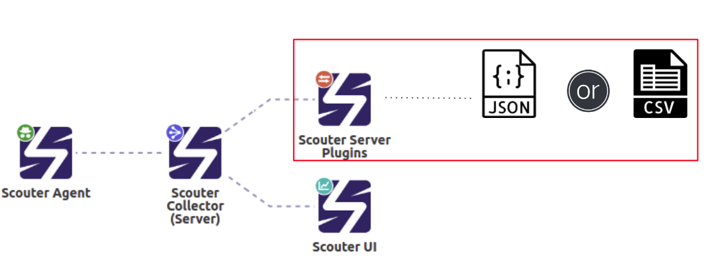

# scouter-plugin-server-metriclog

                                              

- Scouter Server Plugin으로 성능 counter 정보 와 XLOG 정보를 파일 형태로 남기는 plugin 이다.  
     

### configuration (스카우터 서버 설치 경로 하위의 conf/scouter.conf)
#### 기본 설정
* **ext_plugin_fl_enabled** : 본 plugin 사용 여부 (default : true)
* **ext_plugin_fl_counter_index** : Counter 로깅 파일 index의 Prefix 명 (default : scouter-counter)
* **ext_plugin_fl_xlog_index** :  XLog 로깅 파일 index의 Prefix 명 (default : scouter-xlog)
* **ext_plugin_fl_counter_duration_day** : Counter index 저장 기간 (default : 3) ,3일
* **ext_plugin_fl_xlog_duration_day** : XLog index 저장 기간 (default : 3) , 3일
* **ext_plugin_fl_root_dir** : Log를 저장할 Root 디렉토리명 (default : 스카우터 설치 홈/ext_plugin_filelog)
* **ext_plugin_fl_rotate_dir** : Log를 Rotate 할 디렉토리명 (default : 스카우터 설치 홈/ext_plugin_filelog/rotate)
* **ext_plugin_fl_extension** : Log 파일 확장자 명(default : json ,저장 내용은 라인피드 json 포맷으로 저장된다, 그외의 포맷은 CSV 형태로 저장함 )

### 로깅을 이용한 연동 케이스 
 - [엘라스틱 스택을 활용한 데이터 연동문서](./usecase/es-stack/ELASTIC-SCOUTER-PLUGIN.md)
 - 엘라스틱 스택 연동 바로 시작하기 
[](https://asciinema.org/a/zYeOGkzJgpWXE2opasv5X0ytl)  
 - 세팅 완료 후 http://localhost:5601 
 
### dependencies
Refer to [pom.xml](./pom.xml)

### Build environment 
 - Java 1.8.x 이상 
 - Maven 3.x 이상 

### Build
 - mvn clean install
    
### Manual Deploy
 - target에 생성되는 scouter-plugin-server-metriclog-x.x.x.jar 와 target/lib에 생성되는 전체 library를 scouter sever의 lib 디렉토리에 저장하고 scouter server를 재시작한다
### Deploy
 - Release 페이지에서 아래 두개의 파일을 선택하여 다운로드 한다. 
    - dep-lib.tar.gz 
    - scouter-plugin-server-metriclog-1.0.0.jar       
 1. tar xvf dep-lib.tar.gz 파일을 압축을 푼후 모든 (*.jar) 파일을  scouter sever의 lib 디렉토리에 저장 한다. 
 2. scouter-plugin-server-metriclog-1.0.0.jar scouter sever의 lib 디렉토리에 저장 한다. 
 3. 그리고 scouter server를 재시작한다. 
### Metric Define 
 - [메트릭 로깅 데이터 정의 설명서](https://docs.google.com/spreadsheets/d/1tNjMa-wgqn1QglF5QtNvPR5t4P1ovojLnjE25TixRl0/edit?usp=sharing) 
### Support Scouter Version
 - 1.5.x 이상     
### 로깅 결과 샘플 
## 스카우터 시스템 모니터링 메트릭 샘플 ( scouter-counter-host.json)
 - 2초 주기로 데이터 샘플링 발생 
```json
...
{

  "startTime": "20190916T000006.910+0900",
  "objName": "/sc-api-demo-m01.localdomain",
  "server_id": "SCCOUTER-DEMO-COLLECTOR",
  "objHash": "x1bjrpc2",
  "objType": "HOST-ScouterDemo",
  "objHost": "sc-api-demo-m01.localdomain",
  "objId": "sc-api-demo-m01.localdomain",
  "objFamily": "host",
  "host": {
    "startTime": "20190916T000006.910+0900",
    "MemA": 542,
    "TcpStatEST": 62,
    "DiskReadBytes": 510361,
    "DiskWriteBytes": 2202419,
    "TcpStatTIM": 55,
    "UserCpu": 4.178249,
    "NetRxBytes": 57551,
    "PageIn": 0,
    "NetOutBound": 47,
    "TcpStatFIN": 0,
    "SysCpu": 1.7644106,
    "NetTxBytes": 11341,
    "TcpStatCLS": 0,
    "MemU": 1460,
    "Mem": 72.89831,
    "MemT": 2003,
    "Cpu": 21.120062,
    "PageOut": 0,
    "Swap": 0,
    "SwapU": 0,
    "SwapT": 0,
    "NetInBound": 72
}
...
```
## 스카우터 자바 모니터링 메트릭 샘플 ( scouter-counter-javaee.json)
 - 2초 주기로 데이터 샘플링 발생
```json
...
{
  "startTime": "20190916T000002.388+0900",
  "objName": "/sc-api-demo-s01.localdomain/sampleweb",
  "server_id": "SCCOUTER-DEMO-COLLECTOR",
  "objHash": "z1cp362a",
  "objType": "ScouterDemoJava",
  "objHost": "sc-api-demo-s01.localdomain",
  "objId": "sampleweb",
  "objFamily": "javaee",
  "javaee": {
    "startTime": "20190916T000002.388+0900",
    "ElapsedTime": 707,
    "ServiceCount": 197,
    "Elapsed90%": 1990,
    "RecentUser": 5,
    "ApiTime": 244,
    "ErrorRate": 5.319149,
    "QueuingTime": 0,
    "GcCount": 1,
    "SqlErrorRate": 1.7241379,
    "GcTime": 4,
    "PermUsed": 63.346184,
    "SqlTime": 4,
    "ApiErrorRate": 0,
    "SqlTPS": 5.8,
    "ApiTimeByService": 103,
    "HeapTotal": 111.609375,
    "HeapUsed": 58.349815,
    "TPS": 3.1333334,
    "ActiveService": 4,
    "ApiTPS": 1.3333334,
    "SqlTimeByService": 9
  }
}
...
{
  "startTime": "20190916T000002.907+0900",
  "objName": "/sc-api-demo-m01.localdomain/sampleweb",
  "server_id": "SCCOUTER-DEMO-COLLECTOR",
  "objHash": "z135cg1n",
  "objType": "ScouterDemoJava",
  "objHost": "sc-api-demo-m01.localdomain",
  "objId": "sampleweb",
  "objFamily": "javaee",
  "javaee": {
    "startTime": "20190916T000002.907+0900",
    "ProcCpu": 1.4985023
  }
}
...
```
## 스카우터 XLOG 메트릭 샘플( scouter-counter-xlog.json)
 - XLOG : XLOG 수신 후 즉시 발생  
```json
...
{
  "startTime": "20190916T000000.433+0900",
  "objName": "/sc-api-demo-m01.localdomain/sampleweb",
  "server_id": "SCCOUTER-DEMO-COLLECTOR",
  "objHash": "z135cg1n",
  "objType": "java",
  "objHost": "sc-api-demo-m01.localdomain",
  "objId": "sampleweb",
  "objFamily": "tracing",
  "tracing": {
    "startTime": "20190916T000000.433+0900",
    "endTime": "20190916T000000.433+0900",
    "startTimeEpoch": 1568559600433,
    "endTimeEpoch": 1568559600433,
    "serviceName": "/error",
    "threadName": "http-nio-8080-exec-7",
    "gxId": "0",
    "txId": "x55btfu4dcsa5k",
    "caller": "0",
    "elapsed": 0,
    "error": 0,
    "cpu": 0,
    "sqlCount": 0,
    "sqlTime": 0,
    "ipAddr": "127.0.0.1",
    "allocMemory": 53,
    "userAgent": "unirest-java/1.3.11",
    "referrer": "",
    "group": "/**",
    "apiCallCount": 0,
    "apiCallTime": 0
  }
}
...
```
