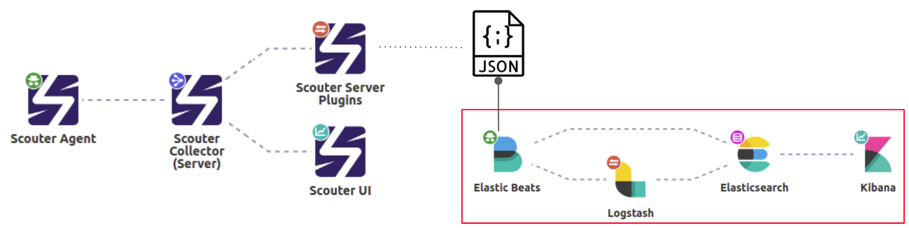
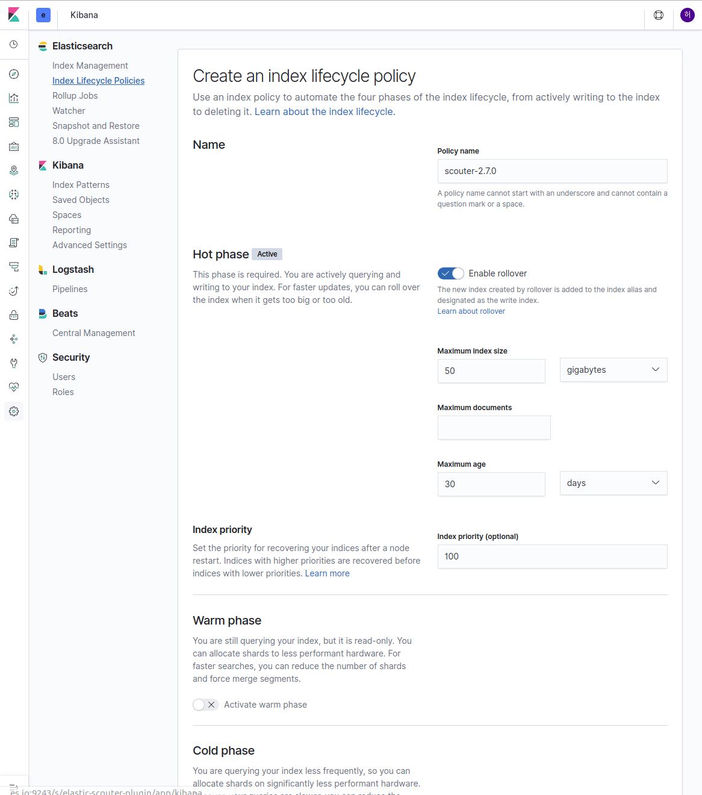

# Quick Install Guide 
 [](https://asciinema.org/a/zYeOGkzJgpWXE2opasv5X0ytl)
 - 참고로 위 동영상은 docker을 활용한 설정으로 보안 설정은 제거하고 실행한 영상       
  
# 순서 
  1. 데이터 수집, 파이프 라인 구성, 색인, 맵핑 및 템플릿 
  2. Kibana 대시보드 Import

##  데이터 수집, 색인, 맵핑 및 템플릿
### 1. 데이터 수집 
  - 스카우터 서버 메트릭 플러그인을 설치 하고 데이터 로깅이 동작 하고 있어야 한다. 스카우터 서버 플러그인 설치방법은 메트릭 로그 플러그인 소개 페이지에서 확인 한다. 
  
### 2. 전송 파이프 라인 구성 
  - 스카우터 APM(성능모니터링) 특징 메트릭 로깅의 주기가 메트릭 로그 2초 한번, 트랜잭션 로그가 1초 이내  많은 로그 동시에 쏟아져 나온다. 
    따라서 해당 대용량 로그를 전송하기 위해 Filebeat(파일 로그 전송 담당) 와 Logstash(중간 버퍼 및 데이터 변환 담당)을 구성한다. 
    
         
  
### 3. FileBeat 를 이용한 Logstash로 로그 전송
  Filebeat 설정은 [config/filebeat.yml](./config/filebeat.yml) 파일을 참조한다. 
  
  Filebeat를 scouter-plugin-server-metriclog/usecase/es-stack 경로에 다운로드 후 압축을 풉다. 
  
  ```
  filebeat-*/filebeat -e -c config/filebeat.yml -d pulish 
  ```
### 4.FileBeat 로그 수신 후 Logstash에서 Elasticsearch로 색인      
  Logstash 설정은 [config/scouter-metric-log.conf](./config/scouter-metric-log.conf) 파일을 참조한다.
  
  Logstash를 scouter-plugin-server-metriclog/usecase/es-stack 경로에 다운로드 후 압축을 풉다.  
  
  ```
  logstash-*/bin/logstash -f config/scouter-metric-log.conf
  ```      
### 5. 엘라스틱 서치 lifecycle policy 적용
  스카우터 메트릭로그가 하루 누적 크기가 1기가 이상 되기 때문에 반드시 데이터 보관 주기 설정이 필요하다 
  데이터를 누적하기 전 데이터 보관 주기 설정을 위한 lifecycle policy 를 설정한다.  
          

### 6. scouter-2.7.0* 템플릿 생성
  mappings 와 settings 를 설정하기 위해 [config/index-settings-mappings.conf](./config/index-setting-mappings.conf) 파일을 참고한다.
  
  [config/index-settings-mappings.conf](./config/index-setting-mappings.conf) 파일 내용대로 실행해서 템플릿 저장 한다.  
       
  이후 Logstash로 데이터 다시 색인

### 7. Kibana에 scouter-dashboard import   

  스카우터 데이터를 보기위해 대시보드 템플릿을 키바나에 import 해야 한다. 
   
   [dashboard/scouter-dashboard.ndjson](./dashboard/scouter-dashboard.ndjson) 파일을 Kibana UI를 통해 import를 실행한다.
  
   import 방법은 아래 가이드 문서를 참고하여 실행한다.     
   - import 가이드 참고 문서 
     - https://www.elastic.co/kr/blog/how-to-migrate-to-kibana-spaces
     
         
